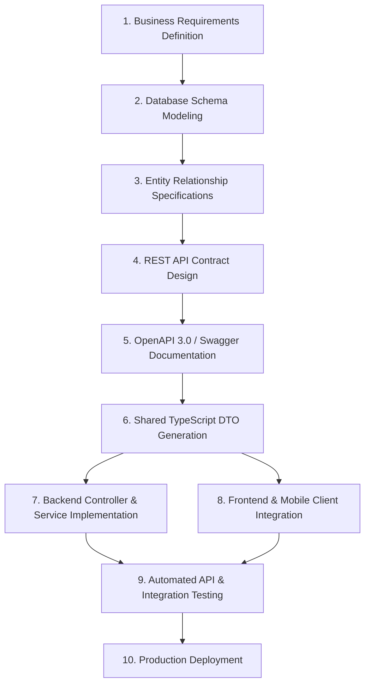
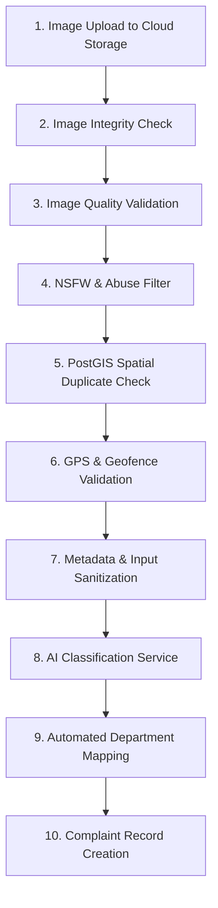
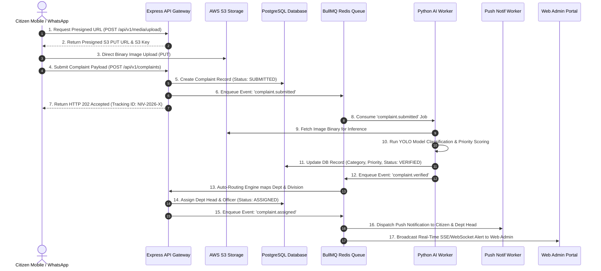
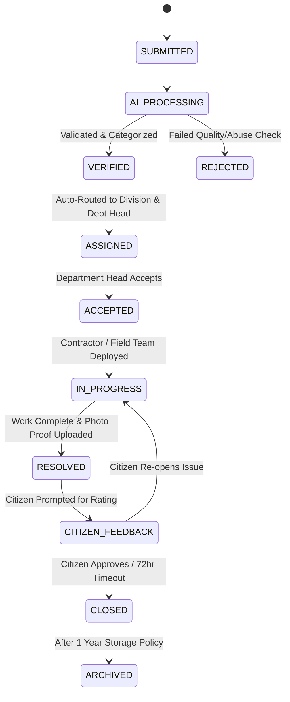

# Enterprise Master Implementation Plan — SmartGovAI (Nivaranam)
## AI-Powered Smart Civic Issue Resolution & Governance Platform

### Document Metadata
- **Version**: 2.2.0 (Master Enterprise Blueprint - Final Pass)
- **Status**: Pending Phase 0.5 Architecture Freeze Sign-Off
- **Target Platform**: SmartGovAI / Nivaranam Municipal Platform
- **Lead Author**: Principal Software Architect, AI Architect, Cloud Architect, DevOps Architect & Security Architect Team

---

## Executive Summary
SmartGovAI (Nivaranam) is an enterprise-grade civic governance platform designed to revolutionize municipal issue resolution through computer vision AI, real-time spatial heatmaps, multi-tiered government administrative workflows, and citizen-centric reporting channels (Mobile App & WhatsApp Bot).

This document serves as the **definitive, single source of truth** for the architecture, engineering standards, database models, AI evaluation criteria, security policies, and deployment strategies for the SmartGovAI project.

---

## 🏛️ SYSTEM ARCHITECTURE BLUEPRINT

```
+-------------------------------------------------------------------------------------------------------------------+
|                                            CITIZEN INTERFACE LAYER                                                |
|  +---------------------------------------+               +-----------------------------------------------------+  |
|  | Nivaranam Mobile App (React Native)   |               | WhatsApp Complaint Bot (Meta API / Twilio Webhook)  |  |
|  | (Expo Router, GPS, Camera, i18n)      |               | (Photo Capture, Geo-location, Conversational Bot)   |  |
|  +-------------------+-------------------+               +--------------------------+--------------------------+  |
+----------------------|--------------------------------------------------------------|-----------------------------+
                       |                                                              |
                       +------------------------------+-------------------------------+
                                                      | HTTP / REST API (JSON / Multipart FormData)
                                                      v
+-------------------------------------------------------------------------------------------------------------------+
|                                          API GATEWAY & APPLICATION SERVER                                         |
|  +-------------------------------------------------------------------------------------------------------------+  |
|  | Node.js + Express + TypeScript Core Server                                                                  |  |
|  |  ├── CORS, Helmet, Rate Limiter & Sanitize Middleware                                                      |  |
|  |  ├── JWT & RBAC Auth Middleware (Citizen, Dept Head, Division Admin, Super Admin)                           |  |
|  |  ├── Zod Input Validation & Swagger / OpenAPI Documentation Engine                                         |  |
|  |  ├── S3 Cloud Storage Presigned URL Generator & Media Handler                                               |  |
|  |  ├── PostGIS Spatial Query & Heatmap Engine                                                                 |  |
|  |  └── Prisma ORM Data Access Layer                                                                           |  |
|  +-------------------+------------------------------------+----------------------------------------------------+  |
+----------------------|------------------------------------|-------------------------------------------------------+
                       |                                    |
       +---------------+                                    v
       |                                    +----------------------------------+
       v                                    | ASYNCHRONOUS MESSAGE QUEUE       |
+-----------------------------+             | BullMQ + Redis Event Bus         |
| DATABASE LAYER              |             |  ├── AI Image Inference Queue    |
| PostgreSQL 16 + PostGIS 3.4 |             |  ├── Push & SMS Notification Queue|
| (Spatial Indexing, Encrypted|             |  └── WhatsApp Webhook Response Q |
| Relational Storage)         |             +-----------------+----------------+
+-----------------------------+                               |
       ^                                                      | Async Worker Jobs
       |                                                      v
       |                                    +----------------------------------+
       |                                    | AI VISION MICROSERVICE           |
       |                                    | Python FastAPI + PyTorch / YOLO  |
       |                                    |  ├── Image Preprocessing         |
       |                                    |  ├── Category & Confidence Model |
       |                                    |  └── Priority Scoring Engine     |
       |                                    +-----------------+----------------+
       |                                                      |
       +------------------------------------------------------+ (Write Predictions & Auto-Route)
       ^
       |
+------+:------------------------------------------------------------------------------------------------------------+
|                                              GOVERNMENT ADMIN PORTAL                                              |
|  [ CityFix Web Admin Portal ] (React 18 + Vite + Tailwind CSS + Shadcn UI + Recharts + Vis.gl Google Maps)        |
|   ├── Division Admin Portal (Citywide Overview, Contractor Allocation, AI Predictions, Alerts)                   |
|   ├── Department Head Portal (Filtered Dept Workflows: Roads, Water, Electricity, Sanitation)                      |
|   └── Emergency Citizen Alert Dispatcher                                                                          |
+-------------------------------------------------------------------------------------------------------------------+
```

---

## 🔍 PHASE 0 — COMPLETE PROJECT AUDIT & BASELINE

### 0.1 Audit Summary of Workspace State
The current codebase consists of two static visual prototypes without active databases or backend services:
- `cityfix-admin-panel-main`: React 18 + Vite dashboard using local mock arrays (`src/lib/mockData.ts`).
- `Nivaranam_app`: Expo SDK 54 mobile client using client-side mock logic (`src/services/api.ts` & `src/services/aiService.ts`).

### 0.2 Audit Matrix & Refactoring Directives

| Module / Component | Current File Location | Current State | Target Architecture Role | Action Plan |
| :--- | :--- | :--- | :--- | :--- |
| **Web Admin Root** | `cityfix-admin-panel-main/cityfix-admin-panel-main` | Nested directory | `web-admin/` | Move to monorepo root. Fix Vite entry points. |
| **Mobile App Root** | `Nivaranam_app/Nivaranam_app` | Nested directory | `citizen-app/` | Move to monorepo root. Maintain Expo SDK 54 setup. |
| **Mock Admin Data** | `web-admin/src/lib/mockData.ts` | Hardcoded arrays | Deprecated | Delete; connect pages to Axios React Query API client. |
| **Mock Mobile API** | `citizen-app/src/services/api.ts` | Static mock client | `citizen-app/src/services/api.ts` | Refactor into Axios instance with JWT interceptors & env baseURL. |
| **Mock AI Classifier**| `citizen-app/src/services/aiService.ts` | String keyword search | Deprecated | Replace with BullMQ queue submission & async polling API. |
| **Web Auth Flow** | `web-admin/src/pages/AdminLogin.tsx` | Local password check | JWT Auth | Connect to `POST /api/v1/auth/login`. |
| **Mobile Auth Flow** | `citizen-app/src/screens/auth/LoginScreen.tsx` | Fixed OTP `123456` | SMS Gateway API | Connect to `POST /api/v1/auth/send-otp` & `verify-otp`. |
| **Google Maps** | `web-admin/src/components/GoogleHeatmap.tsx` | Hardcoded pins | Dynamic Heatmap | Connect to PostGIS GeoJSON endpoint `GET /api/v1/spatial/heatmap`. |

---

## 🔒 PHASE 0.5 — ARCHITECTURE FREEZE (MANDATORY APPROVAL GATE)

Immediately following the Project Audit phase, the project MUST formally execute and approve **Phase 0.5 — Architecture Freeze**.

### 0.5.1 Mandatory Sign-Off Directive
> [!CAUTION]
> **No feature development or code implementation may begin until the Architecture Freeze is formally approved by the Engineering Leadership team.**

After this point, any proposed architectural changes MUST occur exclusively through documented design decisions via formal Architecture Decision Records (ADR).

### 0.5.2 Freeze Scope & Checklist

| Parameter | Architectural Scope | Status | Sign-Off Reference |
| :--- | :--- | :--- | :--- |
| **1. Folder Structure** | Unified monorepo structure (`citizen-app`, `web-admin`, `backend`, `ai-service`, `shared`, `database`) | PENDING | Section 1.1 |
| **2. Monorepo Layout** | Root workspace npm layout, shared dependencies, typescript references | PENDING | Section 1.1 |
| **3. Repository Structure**| Single git repository layout (`SmartGovAI`) with `.gitignore` and `README.md` | PENDING | Section 1.1 |
| **4. Backend Architecture**| Node.js + Express + TypeScript (Clean Layered Architecture: Controllers, Services, Repositories) | PENDING | Section 3.1 |
| **5. Database Schema** | PostgreSQL 16 + PostGIS + Prisma ORM Schemas & Indexes | PENDING | Section 4.1 |
| **6. API Contracts** | OpenAPI 3.0 REST endpoints, request/response DTOs | PENDING | Section 2.1 |
| **7. Authentication Strategy**| Phone/OTP & Email/Password with JWT Access (15m) & Refresh Tokens (7d) | PENDING | Section 12.1 |
| **8. Authorization Model**| RBAC Matrix (Citizen, Department Head, Division Admin, Super Admin) | PENDING | Section 12.2 |
| **9. AI Architecture** | Python FastAPI microservice + decoupled BullMQ worker queue | PENDING | Section 8.1 |
| **10. Deployment Architecture**| Multi-container Docker Compose + Nginx reverse proxy + CloudFront CDN | PENDING | Section 18.1 |
| **11. Infrastructure Layout**| Cloud provider layout (AWS S3, Managed PostgreSQL, Managed Redis) | PENDING | Section 5.1 |
| **12. Environment Strategy**| 4-Tier Isolation (Development, Testing, Staging, Production) | PENDING | Section 17.1 |

---

## 📐 API-FIRST DEVELOPMENT METHODOLOGY

To ensure seamless frontend-backend coordination and prevent broken API contracts, SmartGovAI strictly follows an **API-First Development Strategy**:



### Core API-First Principles:
1. **API Contracts First**: All API contracts must be fully specified and documented in OpenAPI 3.0 format before frontend or mobile integration begins.
2. **No Frontend Speculation**: Frontend and mobile applications MUST NEVER invent or assume API response structures. All interactions must adhere strictly to published DTO contracts.
3. **Strict Backend Adherence**: Backend implementation must implement the exact request payloads, HTTP status codes, and error formats defined in the API contract.

---

## 📂 PHASE 1 — REPOSITORY STRUCTURE & VERSION CONTROL

### 1.1 Enterprise Monorepo Directory Tree

```
SmartGovAI/
├── citizen-app/                     # Expo React Native Mobile Client
│   ├── app/                         # Expo Router v6 pages (_layout, (tabs), (report))
│   ├── src/
│   │   ├── components/              # UI elements & complaint cards
│   │   ├── i18n/                    # Multi-language translations (EN, HI, MR, TA, TE, BN)
│   │   ├── screens/                 # Native screen implementations
│   │   └── services/                # Axios API client, Location, Storage
│   ├── app.json                     # Expo SDK 54 config
│   └── package.json
│
├── web-admin/                       # React 18 + Vite Admin Web Portal
│   ├── src/
│   │   ├── components/              # AdminHeader, AdminSidebar, GoogleHeatmap, StatCards
│   │   ├── pages/                   # Admin login, Dashboard, Complaints, Analytics, Alerts
│   │   ├── hooks/                   # React Query custom hooks
│   │   └── lib/                     # API client utilities
│   ├── index.html
│   ├── vite.config.ts
│   └── package.json
│
├── backend/                         # Node.js + Express + TypeScript Core Backend
│   ├── src/
│   │   ├── config/                  # DB, S3, Redis & Environment variables
│   │   ├── controllers/             # Auth, Complaint, Admin, Spatial, Contractor Controllers
│   │   ├── middlewares/             # JWT auth, RBAC guards, Zod validator, Rate limiter
│   │   ├── queues/                  # BullMQ processors (AI Inference, Push Notifications)
│   │   ├── repositories/            # Prisma data access layer
│   │   ├── services/                # Business logic, Auto-routing engine, S3 service
│   │   ├── routes/                  # Express route definitions
│   │   └── server.ts                # Express app bootstrap
│   ├── tsconfig.json
│   └── package.json
│
├── ai-service/                      # Python FastAPI Computer Vision Service
│   ├── models/                      # Model weights directory (.pt / .onnx)
│   ├── src/
│   │   ├── predictor.py             # Inference pipeline & NMS post-processing
│   │   ├── validator.py             # Image integrity & quality checks
│   │   └── main.py                  # FastAPI application & /predict endpoints
│   ├── tests/                       # PyTest evaluation suites
│   ├── requirements.txt
│   └── Dockerfile
│
├── whatsapp-bot/                    # Node.js Webhook Server for Meta / Twilio
│   ├── src/
│   │   ├── handlers/                # Message, Photo & Location handlers
│   │   ├── services/                # Media download & Backend API client
│   │   └── index.ts                 # Webhook entry point
│   └── package.json
│
├── shared/                          # Shared TypeScript Contracts & Utilities
│   ├── types/                       # Shared User, Complaint, API DTO interfaces
│   └── constants/                   # Issue categories, priority enums, status codes
│
├── database/                        # Database Management & Migrations
│   ├── prisma/
│   │   ├── schema.prisma            # PostgreSQL + PostGIS schema
│   │   ├── seed.ts                  # Seed script for Cities, Depts, Divisions, Admins
│   │   └── migrations/              # Prisma SQL migration history
│   └── docker-compose.db.yml        # Local PostgreSQL + Redis dev setup
│
├── dataset/                         # Dataset Engineering & ML Lifecycle (Separated Module)
│   ├── raw/                         # Collected raw civic images
│   ├── annotated/                   # YOLO / COCO format annotations
│   ├── scripts/                     # Cleaning, augmentation, split & export scripts
│   └── data.yaml                    # Dataset version metadata
│
├── docs/                            # Living Architecture Documentation
│   ├── 00_Project_Vision.md         # Project goals and background
│   ├── 01_Architecture.md           # System topology and diagrams
│   ├── 02_API_Design.md             # OpenAPI specs and endpoint guidelines
│   ├── 03_Database_Design.md        # Prisma ERD and indexing strategy
│   ├── 04_AI_Architecture.md        # Model evaluation and inference specs
│   ├── 05_Development_Roadmap.md    # Phase schedules and milestone tracking
│   ├── 06_Deployment.md             # Docker and cloud deployment guide
│   ├── 07_Testing.md                # Jest, PyTest, and Supertest procedures
│   ├── 08_Security.md               # Auth, RBAC, CORS, and encryption policy
│   ├── 09_Governance.md             # ADR processes and maintainer rules
│   ├── adr/                         # Architecture Decision Records directory
│   └── openapi.yaml                 # Master OpenAPI 3.0 specification
│
├── deployment/                      # DevOps Containerization & Orchestration
│   ├── docker-compose.yml           # Full multi-container production stack
│   ├── nginx.conf                   # Reverse proxy & SSL config
│   └── github-actions/              # CI/CD pipeline definitions
│
├── .gitignore                       # Multi-stack gitignore rules
├── README.md                        # Enterprise repository overview
└── package.json                     # Monorepo workspace config
```

---

## 🗺️ PHASE 2 — MASTER DEVELOPMENT ROADMAP (VERSION 1 MVP SCOPE)

Development follows an incremental, module-by-module implementation order:

```mermaid
gantt
    title SmartGovAI Version 1 (MVP) Development Schedule
    dateFormat  YYYY-MM-DD
    section Setup & Core
    Module 1: Monorepo & Git Restructuring     :m1, 2026-08-01, 3d
    Module 2: Database Schema & PostGIS        :m2, after m1, 4d
    Module 3: Express Backend & Auth Engine    :m3, after m2, 6d
    section AI & Storage
    Module 4: S3 Upload & Validation Pipeline  :m4, after m3, 4d
    Module 5: AI Model Benchmarking & Service  :m5, after m4, 7d
    Module 6: Dataset Engineering Pipeline     :m6, parallel m5, 5d
    section Apps & Automations
    Module 7: Citizen Mobile App Integration   :m7, after m5, 8d
    Module 8: Web Admin Portal Integration     :m8, after m7, 8d
    Module 9: Automated Routing Engine         :m9, parallel m8, 4d
    Module 10: Spatial Heatmaps & PostGIS      :m10, after m8, 4d
    section Messaging & Infra
    Module 11: WhatsApp Webhook Bot            :m11, after m10, 5d
    Module 12: Notification & Alert Engine     :m12, after m11, 4d
    Module 13: CI/CD Quality Gates & Docker    :m13, after m12, 5d
```

---

## 🏗️ PHASE 3 — BACKEND ARCHITECTURE & STACK JUSTIFICATION

### 3.1 Technology Choice & Rationale

| Layer | Selected Technology | Justification over Alternatives |
| :--- | :--- | :--- |
| **Backend Runtime** | Node.js + Express + TypeScript | High I/O performance for concurrent file uploads and real-time sockets; shares TypeScript types cleanly with frontend clients. |
| **Database** | PostgreSQL 16 + PostGIS | Enterprise spatial indexing (`ST_DWithin`, `ST_Point`) essential for complaint radius lookups and heatmaps; ACID compliance. |
| **ORM Layer** | Prisma ORM | Full type-safety shared across monorepo packages; intuitive migrations and SQL query optimization. |
| **Caching & Queues**| Redis + BullMQ | Handles decoupled background processing (AI inference, push dispatches, WhatsApp media downloads). |
| **AI Framework** | Python FastAPI + PyTorch | Native Python ecosystem for computer vision models with high-performance async API serving. |

---

## 💾 PHASE 4 — DATABASE DESIGN & ENTITY RELATIONSHIPS

### 4.1 Production Prisma PostgreSQL Schema

```prisma
datasource db {
  provider   = "postgresql"
  url        = env("DATABASE_URL")
  directUrl  = env("DIRECT_URL")
}

generator client {
  provider        = "prisma-client-js"
  previewFeatures = ["postgresqlExtensions"]
}

enum Role {
  CITIZEN
  DEPARTMENT_HEAD
  DIVISION_ADMIN
  SUPER_ADMIN
}

enum ComplaintStatus {
  SUBMITTED
  AI_PROCESSING
  VERIFIED
  ASSIGNED
  ACCEPTED
  IN_PROGRESS
  RESOLVED
  CITIZEN_FEEDBACK
  CLOSED
  REJECTED
  ARCHIVED
}

enum Priority {
  LOW
  MEDIUM
  HIGH
  EMERGENCY
}

enum SubmissionSource {
  MOBILE_APP
  WHATSAPP_BOT
  WEB_PORTAL
}

model User {
  id            String          @id @default(uuid())
  phoneNumber   String?         @unique
  email         String?         @unique
  passwordHash  String?
  fullName      String
  role          Role            @default(CITIZEN)
  cityId        String?
  divisionId    String?
  departmentId  String?
  avatarUrl     String?
  isActive      Boolean         @default(true)
  createdAt     DateTime        @default(now())
  updatedAt     DateTime        @updatedAt

  city          City?           @relation(fields: [cityId], references: [id])
  division      Division?       @relation(fields: [divisionId], references: [id])
  department    Department?     @relation(fields: [departmentId], references: [id])
  complaints    Complaint[]     @relation("CitizenComplaints")
  assignedTasks Complaint[]     @relation("OfficerAssignments")
  upvotes       Upvote[]
  notifications Notification[]
  auditLogs     AuditLog[]

  @@index([role])
  @@index([phoneNumber])
  @@index([email])
}

model City {
  id          String      @id @default(uuid())
  name        String      @unique // e.g., "Mumbai", "Delhi", "Bengaluru"
  state       String
  divisions   Division[]
  users       User[]
  createdAt   DateTime    @default(now())
}

model Division {
  id          String      @id @default(uuid())
  name        String      // e.g., "North Division", "Zone 4"
  cityId      String
  city        City        @relation(fields: [cityId], references: [id])
  users       User[]
  complaints  Complaint[]
  contractors Contractor[]
  createdAt   DateTime    @default(now())

  @@unique([name, cityId])
}

model Department {
  id          String      @id @default(uuid())
  name        String      @unique // e.g., "Roads & Infrastructure", "Water Supply"
  code        String      @unique // e.g., "ROADS", "WATER", "SANITATION", "POWER"
  description String?
  users       User[]
  complaints  Complaint[]
  createdAt   DateTime    @default(now())
}

model Complaint {
  id                String          @id @default(uuid())
  trackingId        String          @unique // e.g., "NIV-2026-98412"
  citizenId         String
  assignedOfficerId String?
  departmentId      String?
  divisionId        String?
  contractorId      String?
  title             String
  description       String
  category          String          // e.g., "POTHOLE", "GARBAGE_DUMP", "WATER_LEAK"
  status            ComplaintStatus @default(SUBMITTED)
  priority          Priority        @default(MEDIUM)
  source            SubmissionSource@default(MOBILE_APP)
  
  // Spatial Fields
  latitude          Float
  longitude         Float
  address           String
  landmark          String?
  
  // AI Metrics
  aiConfidence      Float           @default(0.0)
  aiDetectedCategory String?
  aiIsDuplicate     Boolean         @default(false)
  duplicateOfId     String?
  
  // Social & Resolution Tracking
  upvoteCount       Int             @default(0)
  resolvedAt        DateTime?
  resolutionProofUrl String?
  resolutionComment String?
  rating            Int?            // Citizen rating (1 to 5)
  feedbackComment   String?
  
  createdAt         DateTime        @default(now())
  updatedAt         DateTime        @updatedAt

  citizen           User            @relation("CitizenComplaints", fields: [citizenId], references: [id])
  assignedOfficer   User?           @relation("OfficerAssignments", fields: [assignedOfficerId], references: [id])
  department        Department?     @relation(fields: [departmentId], references: [id])
  division          Division?       @relation(fields: [divisionId], references: [id])
  contractor        Contractor?     @relation(fields: [contractorId], references: [id])
  duplicateOf       Complaint?      @relation("DuplicateLink", fields: [duplicateOfId], references: [id])
  duplicates        Complaint[]     @relation("DuplicateLink")
  media             ComplaintMedia[]
  statusHistory     StatusHistory[]
  upvotes           Upvote[]

  @@index([latitude, longitude])
  @@index([status])
  @@index([category])
  @@index([divisionId])
  @@index([departmentId])
  @@index([trackingId])
}

model ComplaintMedia {
  id          String    @id @default(uuid())
  complaintId String
  s3Key       String
  publicUrl   String
  mediaType   String    @default("IMAGE") // IMAGE, VIDEO
  fileSizeBytes Int
  mimeType    String
  createdAt   DateTime  @default(now())

  complaint   Complaint @relation(fields: [complaintId], references: [id], onDelete: Cascade)
}

model StatusHistory {
  id          String          @id @default(uuid())
  complaintId String
  status      ComplaintStatus
  comment     String?
  changedById String
  createdAt   DateTime        @default(now())

  complaint   Complaint       @relation(fields: [complaintId], references: [id], onDelete: Cascade)
}

model Upvote {
  id          String    @id @default(uuid())
  complaintId String
  userId      String
  createdAt   DateTime  @default(now())

  complaint   Complaint @relation(fields: [complaintId], references: [id], onDelete: Cascade)
  user        User      @relation(fields: [userId], references: [id], onDelete: Cascade)

  @@unique([complaintId, userId])
}

model Contractor {
  id            String      @id @default(uuid())
  name          String
  agencyName    String
  contactNumber String
  email         String
  divisionId    String
  rating        Float       @default(5.0)
  activeTasks   Int         @default(0)
  completedTasks Int        @default(0)
  createdAt     DateTime    @default(now())

  division      Division    @relation(fields: [divisionId], references: [id])
  complaints    Complaint[]
}

model Notification {
  id        String   @id @default(uuid())
  userId    String
  title     String
  message   String
  read      Boolean  @default(false)
  type      String   // "STATUS_CHANGE", "EMERGENCY_ALERT", "ASSIGNMENT"
  payload   Json?
  createdAt DateTime @default(now())

  user      User     @relation(fields: [userId], references: [id], onDelete: Cascade)
}

model AuditLog {
  id        String   @id @default(uuid())
  userId    String?
  action    String   // e.g. "USER_LOGIN", "COMPLAINT_STATUS_UPDATE", "ALERT_DISPATCH"
  ipAddress String?
  userAgent String?
  details   Json?
  createdAt DateTime @default(now())

  user      User?    @relation(fields: [userId], references: [id])
}
```

### 4.2 Database Documentation Maintenance Guidelines
> [!NOTE]
> For long-term maintainability, the Master Implementation Plan presents a high-level conceptual overview of database models. The authoritative living database schema resides in `database/prisma/schema.prisma` and `docs/03_Database_Design.md`. All future schema evolutions must be performed via Prisma migrations in those files and referenced back to this Master Document.

---

## ☁️ PHASE 5 — CLOUD STORAGE STRATEGY & FILE UPLOADS

### 5.1 Storage Architecture Principles
> [!WARNING]
> **Strict Rule**: Raw binary image or video files MUST NEVER be stored directly inside PostgreSQL `BYTEA` columns or on local application server filesystems.

```
Citizen Mobile App / WhatsApp
          │
          │ 1. Requests Upload Auth: POST /api/v1/media/presigned-url
          v
Express Backend API Server ─── (Generates S3 Presigned PUT URL + S3 Key)
          │
          │ 2. Returns Presigned URL
          v
Citizen Mobile App / WhatsApp
          │
          │ 3. Direct Binary Upload (PUT)
          v
AWS S3 Object Storage Bucket ─── (Triggers CDN Caching via CloudFront)
          │
          │ 4. Submits Complaint Payload with S3 Key: POST /api/v1/complaints
          v
Express Backend API Server ─── (Saves Metadata & S3 URL in PostgreSQL DB)
```

### 5.2 Storage Provider Comparison & Recommendation

| Parameter | Cloudinary | AWS S3 + CloudFront | Supabase Storage |
| :--- | :--- | :--- | :--- |
| **Data Sovereignty** | US Multi-tenant | **AWS ap-south-1 (Mumbai Region)** | AWS Managed |
| **Cost at Scale** | High (Credit-based) | **Extremely Low ($0.023/GB)** | Medium |
| **CDN Integration** | Built-in | **Native CloudFront Edge CDN** | Built-in |
| **Presigned URLs** | Limited | **Native Presigned PUT/POST URLs** | Native |
| **Recommendation** | Prototype only | **RECOMMENDED FOR PRODUCTION** | Alternative |

**Final Recommendation**: **AWS S3 (ap-south-1 Mumbai)** paired with **AWS CloudFront CDN**.

---

## 🛡️ PHASE 6 — COMPLAINT VALIDATION PIPELINE

Before any complaint record is created, it MUST pass sequentially through a 9-stage verification pipeline to prevent spam and duplicates:



### Stage Details:
1. **Image Integrity Check**: Validates file headers (JPEG, PNG, WEBP) and dimensions (Min 400x400px).
2. **Image Quality Validation**: Computes Laplacian variance (Threshold > 100) to reject blurry or pitch-black photos.
3. **NSFW Detection**: Filters obscene/inappropriate content before queuing for AI inference.
4. **PostGIS Duplicate Detection**: Queries 50-meter radius (`ST_DWithin`) for active complaints created in the last 48 hours.
5. **GPS Geofence Validation**: Verifies coordinates lie within configured city/municipal boundary coordinates.
6. **Input Sanitization**: Zod validation stripping malicious HTML/script tags from user text inputs.

---

## ⚡ PHASE 7 — ASYNCHRONOUS & EVENT-DRIVEN ARCHITECTURE

### 7.1 Queue-Based Processing (BullMQ + Redis)
To ensure sub-200ms API response times for citizens, long-running AI inference, notifications, and WhatsApp responses are processed asynchronously using **BullMQ + Redis**:

```
[ Citizen Upload ] ──► [ Storage (S3) ] ──► [ DB Metadata Saved ]
                                                    │
                                                    │ Enqueues Job
                                                    v
                                        [ BullMQ Redis Event Bus ]
                                                    │
         +------------------------------------------+------------------------------------------+
         |                                          |                                          |
         v                                          v                                          v
[ AI Worker Microservice ]                [ Notification Worker ]                    [ WhatsApp Bot Worker ]
 ├── AI Classification                    ├── Expo Push Dispatches                    └── Meta Webhook Sender
 ├── Priority Detection                   └── SMS Gateway Alerts
 ├── Department Auto-Routing
 └── Analytics Aggregation
```

### 7.2 Event-Driven Sequence Architecture



### 7.3 Event Producer & Consumer Specifications
- **Event Producers**: Express API Gateway (on complaint submission/status patch), WhatsApp Webhook Server, System Crons (on SLA timeouts).
- **Event Consumers**: Python AI Worker (`ai-service`), Notification Worker (Expo Push & SMS Gateway), Analytics Worker (PostGIS aggregation engine).
- **Queue Responsibilities**:
  - `ai-inference-queue`: Concurrency = 4 per worker instance; retry attempts = 3 with exponential backoff.
  - `notification-queue`: Concurrency = 10; retry attempts = 5.
  - `whatsapp-webhook-queue`: Concurrency = 5; rate-limited to match Meta WhatsApp Business API caps.
- **Dead-Letter Queue (DLQ)**: Jobs failing 3 consecutive attempts are moved to `dlq-failed-jobs` with failure stack traces stored for developer inspection.

---

## 🧠 PHASE 8 — AI COMPUTER VISION ARCHITECTURE & FLEXIBLE BENCHMARKING

### 8.1 Model Recommendation & Flexibility Directive
- **Leading Candidate**: **YOLOv11** is currently the primary recommended model based on high sub-50ms CPU/GPU throughput and high detection precision for civic objects (potholes, garbage dumps, water leaks).
- **Flexibility Clause**: The AI microservice architecture abstracts model invocation behind an ONNX / PyTorch runner interface (`predictor.py`). The final production model selection will occur ONLY after empirical benchmarking. Stable future models (e.g., **YOLOv12**) will also be benchmarked if available.

### 8.2 Model Evaluation Benchmarking Matrix

| Evaluation Metric | YOLOv11 (Primary) | YOLOv12 (Candidate) | RT-DETR | Florence-2 | Grounding DINO |
| :--- | :--- | :--- | :--- | :--- | :--- |
| **Detection mAP@50-95** | **44.2%** | 45.8% | 43.1% | 38.5% | 36.2% |
| **Precision / Recall** | **0.91 / 0.88** | 0.92 / 0.89 | 0.89 / 0.85 | 0.82 / 0.80 | 0.79 / 0.76 |
| **F1 Score** | **0.89** | 0.90 | 0.87 | 0.81 | 0.77 |
| **CPU Latency (Intel i7)**| **42ms** | 48ms | 85ms | 320ms | 650ms |
| **GPU Latency (NVIDIA T4)**| **12ms** | 14ms | 18ms | 110ms | 240ms |
| **Memory Usage / VRAM** | **22 MB / 1.2GB**| 24 MB / 1.4GB| 82 MB / 2.8GB| 450 MB / 4.5GB| 1.8 GB / 7.2GB|
| **Inference Speed** | **Ultra-Fast** | Ultra-Fast | Fast | Slow | Very Slow |
| **Fine-Tuning Effort** | **Low (PyTorch)**| Low | Medium | High | High |
| **Deployment Complexity**| **Low** | Low | Medium | High | High |
| **Long-Term Maintainability**| **High** | High | Medium | Medium | Low |

---

## 📦 PHASE 9 — DATASET ENGINEERING MODULE

Dataset engineering is managed as a dedicated, independent project module (`dataset/` directory):

```
[ Raw Data Collection ] ──► [ Image Cleaning & Validation ] ──► [ Annotation (CVAT / Label Studio) ]
                                                                             │
[ Retraining & Continuous ] ◄── [ Evaluation Dataset ] ◄── [ Train / Val / Test Split (70/20/10) ]
```

### 9.1 Module Components:
- **Data Collection & Sources**: Sourcing raw civic images across diverse municipal environments, weather conditions, and lighting angles.
- **Image Validation & Cleaning**: Removing duplicate, corrupted, or low-resolution images.
- **Annotation Standards & Label Taxonomy**: Standardizing bounding box annotation rules for 5 core classes (`POTHOLE`, `GARBAGE_DUMP`, `WATER_LEAKAGE`, `BROKEN_STREETLIGHT`, `OPEN_MANHOLE`).
- **Annotation Tools**: Utilizing CVAT / Label Studio exporting to YOLO / COCO annotation formats.
- **Dataset Versioning**: Managed using DVC / Roboflow version metadata tracked in Git under `dataset/data.yaml`.
- **Data Augmentation**: Applying random rotations (±15°), brightness jitter (±20%), bounding box scaling, and mosaic augmentations.
- **Class Balancing**: Resampling underrepresented civic defect classes to prevent model bias.
- **Train / Validation / Test Split**: Strict 70% Training, 20% Validation, and 10% Test split boundaries.
- **Retraining Strategy**: Monthly continuous improvement pipeline retraining model weights on verified citizen complaint submissions.

---

## 🚦 PHASE 10 — TIERED AI CONFIDENCE WORKFLOW

To prevent incorrect AI predictions from degrading citizen trust, SmartGovAI enforces a tiered confidence workflow with clear fallback behavior:

```
                  AI Inference Result (Confidence Score)
                                    │
         +--------------------------+--------------------------+
         |                          |                          |
         v                          v                          v
  Confidence > 90%           Confidence 80% – 90%       Confidence < 80%
         │                          │                          │
         v                          v                          v
[ Fully Automatic Routing ]  [ User Confirmation Prompt ] [ Manual User Fallback ]
System sets category &       System pre-selects category; System requests citizen
routes directly to Dept.     asks citizen: "Is this a    to select category manually
                             pothole?"                   from drop-down.
```

---

## 🔄 PHASE 11 — COMPLETE COMPLAINT LIFECYCLE



### Allowed State Transitions & Role Permissions

| Status State | Permitted Initiators | Allowed Next States | Required Inputs / Proof | Escalation Rules |
| :--- | :--- | :--- | :--- | :--- |
| `SUBMITTED` | Citizen / WhatsApp | `AI_PROCESSING` | S3 Key, Lat/Lng, Text | Auto-enqueues to queue |
| `AI_PROCESSING`| System Queue Worker | `VERIFIED`, `REJECTED` | Confidence Score, Category | Rejects if invalid |
| `VERIFIED` | Auto-Routing Engine | `ASSIGNED` | Department ID, Division ID | Auto-assigns within 1m |
| `ASSIGNED` | Department Head | `ACCEPTED`, `REJECTED` | Assignment note / Contractor | Auto-escalates after 24h |
| `ACCEPTED` | Dept Head / Contractor | `IN_PROGRESS` | Estimated completion date | Auto-escalates after 48h |
| `IN_PROGRESS` | Contractor / Officer | `RESOLVED` | Resolution Proof Photo (S3)| Auto-escalates after SLA |
| `RESOLVED` | Citizen / System Timer | `CITIZEN_FEEDBACK`, `CLOSED`| Rating (1-5), Feedback Text| Auto-closes after 72h |
| `CLOSED` | System Lifecycle Cron | `ARCHIVED` | Retention timestamp | Archived after 365 days |

---

## 🔐 PHASE 12 — AUTHENTICATION, AUTHORIZATION & API GOVERNANCE

### 12.1 Token Strategy
- **Access Tokens**: Short-lived JWTs (15-minute expiration) signed with HMAC SHA-256.
- **Refresh Tokens**: Long-lived secure HTTP-only cookies (7-day expiration) stored hashed in Redis.

### 12.2 Role-Based Access Control (RBAC) Matrix

| Endpoint Route | Citizen | Department Head | Division Admin | Super Admin |
| :--- | :---: | :---: | :---: | :---: |
| `POST /api/v1/complaints` | ✅ | ❌ | ❌ | ✅ |
| `GET /api/v1/complaints/my` | ✅ | ❌ | ❌ | ✅ |
| `GET /api/v1/dept/dashboard` | ❌ | ✅ (Own Dept Only)| ❌ | ✅ |
| `PATCH /api/v1/complaints/:id/status`| ❌ | ✅ (Own Dept Only)| ✅ (Division Only)| ✅ |
| `POST /api/v1/contractors` | ❌ | ❌ | ✅ (Division Only)| ✅ |
| `POST /api/v1/alerts/broadcast` | ❌ | ❌ | ✅ (Division Only)| ✅ |
| `GET /api/v1/analytics/citywide` | ❌ | ❌ | ❌ | ✅ |

### 12.3 API Versioning & Lifecycle Policy
- **Versioning Strategy**: Mandatory URI-based explicit prefixing (e.g., `/api/v1/...`, `/api/v2/...`).
- **Backward Compatibility**: Existing minor version updates MUST preserve field names and payload shapes. New fields are added as optional properties.
- **Deprecation Strategy**: When an API version is targeted for retirement, a response header `Warning: 299 - "API Version Deprecated. Sunset Date: YYYY-MM-DD"` will be emitted for 90 days.
- **Breaking-Change Policy**: Breaking changes require a major version bump (e.g., `/v1` to `/v2`). `v1` will remain active alongside `v2` for a minimum of 180 days prior to sunset.

---

## 📈 PHASE 13 — WEB ADMIN & ADVANCED ANALYTICS

The Web Admin portal analytics engine visualizes 17+ core municipal metrics:
1. **Complaint Resolution Time**: Average hours to resolve by department.
2. **SLA Compliance Rate**: Percentage resolved within 48-hour municipal window.
3. **Department Performance**: Monthly scorecards across departments.
4. **Officer & Contractor Ratings**: Performance metrics and task completion rates.
5. **Repeat Complaint Analysis**: Identification of recurring infrastructure failures.
6. **Complaint Density**: PostGIS spatial density grids on Google Heatmaps.
7. **Ward-wise Statistics**: Metrics broken down by municipal ward boundaries.
8. **Division-wise Statistics**: Multi-division aggregate comparisons.
9. **Category Trends**: Volume trends (Potholes vs Garbage vs Water Leaks).
10. **Monthly & Seasonal Trends**: Rain/monsoon complaint surge projections.
11. **AI Prediction Accuracy**: Precision and false positive tracking.
12. **Duplicate Percentage**: Ratio of duplicate reports identified by PostGIS.
13. **Average Resolution Time**: Ward-level completion latency.
14. **Citizen Satisfaction Score (CSAT)**: Average 1 to 5 citizen ratings.
15. **Contractor Active vs Completed Tasks**: Resource allocation tracking.
16. **Heatmap Trend Visualizers**: Temporal density changes over time.
17. **Predictive Failure Alerts**: ML-based hotspot failure projections.

---

## 📱 PHASE 14 — MOBILE APPLICATION EXPO DEVELOPMENT BUILD PLAN

- **Build Methodology**: Use Expo **Development Builds** (`npx expo run:android` / `npx expo run:ios`).
- **Native Modules**: `expo-camera`, `expo-location`, `expo-notifications`, `react-native-maps`, `expo-secure-store`.
- **Offline Resilience**: Offline queue caching complaints in `AsyncStorage` when network is unavailable, auto-syncing upon connectivity recovery.

---

## 🗺️ PHASE 15 — GOOGLE MAPS & POSTGIS SPATIAL ENGINE

### 15.1 PostGIS Spatial Query Optimization
Heatmaps and nearby complaint lookups execute natively inside PostgreSQL using PostGIS extension functions:

```sql
-- Spatial Query: Find Nearby Complaints within 5000 meters (5km)
SELECT id, "trackingId", category, status, latitude, longitude,
       ST_Distance(
         ST_SetSRID(ST_MakePoint(longitude, latitude), 4326)::geography,
         ST_SetSRID(ST_MakePoint($user_lng, $user_lat), 4326)::geography
       ) as distance_meters
FROM "Complaint"
WHERE ST_DWithin(
  ST_SetSRID(ST_MakePoint(longitude, latitude), 4326)::geography,
  ST_SetSRID(ST_MakePoint($user_lng, $user_lat), 4326)::geography,
  5000
)
ORDER BY distance_meters ASC;
```

---

## 💬 PHASE 16 — WHATSAPP COMPLAINT BOT (META / TWILIO)

```
Citizen Sends Photo on WhatsApp ──► Meta Webhook ──► whatsapp-bot Microservice
                                                               │
                                                               │ 1. Downloads Media
                                                               v
WhatsApp Bot Returns Confirmation ◄── Backend API ◄── Uploads to S3 & Enqueues AI
"Tracking ID: NIV-2026-98412"
```

---

## 🌍 PHASE 17 — MULTI-ENVIRONMENT INFRASTRUCTURE STRATEGY

Every tier has strict environment isolation. Production credentials MUST NEVER be used in development.

| Parameter | Development (`dev`) | Testing (`test`) | Staging (`stage`) | Production (`prod`) |
| :--- | :--- | :--- | :--- | :--- |
| **Database** | Local Docker Postgres | Local Docker Postgres | Managed Postgres Dev | Multi-AZ Managed Postgres |
| **S3 Bucket** | `smartgov-dev-media` | `smartgov-test-media` | `smartgov-stage-media`| `smartgov-prod-media` |
| **API Endpoint**| `http://localhost:5000` | `http://localhost:5001` | `https://stage-api.smartgov.ai` | `https://api.smartgov.ai` |
| **Redis Queue** | Local Redis | Local Redis | Managed MemoryStore | Multi-Node Redis Cluster |
| **Secrets** | `.env.development` | `.env.test` | AWS Secrets Manager | AWS Secrets Manager |
| **Deployment** | Local Docker Compose | GitHub Actions CI Runner| Staging Server | Production Cluster |

---

## 🚦 PHASE 18 — CI/CD PIPELINES & QUALITY GATES

```mermaid
graph LR
    Push[Git Push / PR] --> Gate1[1. ESLint Check]
    Gate1 --> Gate2[2. TypeScript Compilation]
    Gate2 --> Gate3[3. Security & Secret Scan]
    Gate3 --> Gate4[4. Backend Unit Tests]
    Gate4 --> Gate5[5. Integration Tests]
    Gate5 --> Gate6[6. Docker Build Verification]
    Gate6 --> Deploy[Deployment Pipeline]
```



### Mandatory Quality Gates:
1. **ESLint Validation**: Zero lint errors permitted.
2. **Strict TypeScript Compilation**: `tsc --noEmit` must pass cleanly.
3. **Secret Scan**: `trufflehog` verifying no API keys or credentials are committed.
4. **Test Coverage Threshold**: Minimum 80% statement coverage on core services.

---

## 🔒 PHASE 19 — ENTERPRISE SECURITY & COMPLIANCE

1. **HTTP Security**: Enforced via `helmet` middleware (HSTS, CSP, X-Frame-Options).
2. **Rate Limiting**: 100 requests / 15 mins per IP on public endpoints; 5 login attempts / 15 mins.
3. **Input Sanitization**: Zod validation schemas stripping malicious HTML/SQL injections.
4. **Audit Logging**: Comprehensive tracking of logins, status modifications, and alerts in `AuditLog` table.

---

## ⚡ PHASE 20 — PERFORMANCE & SCALABILITY ENGINE

1. **Redis Caching**: Caching spatial heatmap GeoJSON and department lookup lists in Redis.
2. **CloudFront CDN**: Edge caching of uploaded complaint photos worldwide.
3. **Image Compression**: Resizing and converting uploaded photos to WebP format before S3 storage.
4. **Pagination & Lazy Loading**: Server-side cursor pagination (`limit` & `cursor`) on all data tables.
5. **Database Indexing**: Compound spatial indexes (`GIST`) and composite indexes on `[status, category]`.
6. **Connection Pooling**: PgBouncer connection pooling supporting high concurrent database connections.

---

## 📋 PHASE 21 — COMPREHENSIVE RISK REGISTER

| Risk Category | Risk Event Description | Probability | Impact | Mitigation Strategy |
| :--- | :--- | :---: | :---: | :--- |
| **Technical** | High latency during concurrent AI photo uploads | Medium | High | Async BullMQ processing; citizen receives immediate HTTP 202 response. |
| **AI Vision** | High false positive rate on blurry user photos | High | Medium | Phase 6 Image Quality Gate (Laplacian blur test) rejects unusable photos before inference. |
| **Infrastructure**| Database spatial query bottlenecks under heavy load | Low | High | PostGIS spatial indexing (`GIST`), Redis caching for heatmap GeoJSON. |
| **Security** | DDoS or spam attack on complaint submission | Medium | High | Rate limiting middleware, S3 presigned URL authorization, phone OTP verification. |
| **Scalability** | Storage exhaustion from citizen image uploads | Low | High | S3 Lifecycle policies archiving media older than 1 year to Glacier. |
| **Third-Party** | WhatsApp Meta API rate limit exhaustion | Low | Medium | Message queuing with exponential backoff retry policies in BullMQ. |

---

## 📑 PHASE 22 — PROJECT GOVERNANCE & ADRS

All major architectural decisions MUST be recorded in Architecture Decision Records under `/docs/adr/`.

### Architecture Decision Record Guidelines:
- **Location**: `/docs/adr/XXXX-title.md`
- **Mandatory Requirements**: Record major architecture decisions, alternatives considered, trade-offs, rationale, and approval history.
- **Artifact Synchronization**: Keep architecture diagrams, API documentation, database schemas, and deployment documentation synchronized whenever an ADR is approved.

---

## 📖 PHASE 23 — SUPPORTING DOCUMENTATION STRUCTURE RECOMMENDATION

While this Master Implementation Plan remains the primary reference document, supporting technical documentation should be organized under `/docs` for modular maintainability:

```
docs/
├── 00_Project_Vision.md         # Vision, goals, and stakeholders
├── 01_Architecture.md           # Deep-dive system topology diagrams
├── 02_API_Design.md             # Detailed REST API endpoint contracts
├── 03_Database_Design.md        # Prisma ERD and indexing strategies
├── 04_AI_Architecture.md        # AI model benchmarks and inference specs
├── 05_Development_Roadmap.md    # Milestone schedules and milestone tracking
├── 06_Deployment.md             # Docker compose and cloud deployment guide
├── 07_Testing.md                # Jest, PyTest, and Supertest procedures
├── 08_Security.md               # Auth, RBAC, CORS, and encryption policy
├── 09_Governance.md             # ADR processes and maintainer rules
├── adr/                         # Architecture Decision Records directory
└── openapi.yaml                 # Master OpenAPI 3.0 specification
```

---

## 🎯 PHASE 24 — SCOPE BOUNDARY: MVP (V1) VS FUTURE ROADMAP (V2)

To prevent scope creep and ensure on-time delivery of a robust platform, feature boundaries are strictly drawn:

### Version 1 (MVP Scope — Mandatory Core Platform)
- [x] Monorepo Restructuring & Git Version Control Setup
- [x] PostgreSQL + PostGIS Database & Prisma Schemas
- [x] Node.js Express Core Backend with JWT Auth & RBAC
- [x] S3 Decoupled Cloud Storage Media Upload Engine
- [x] 9-Stage Complaint Validation & Abuse Prevention Pipeline
- [x] BullMQ + Redis Queue Asynchronous AI Inference Engine
- [x] Fine-Tuned AI Computer Vision Microservice (FastAPI + YOLO)
- [x] Tiered AI Confidence Auto-Routing Workflow
- [x] Nivaranam Expo Citizen Mobile App (Camera, Maps, History, i18n)
- [x] CityFix Web Admin Portal (Dashboards, Complaints Table, Analytics)
- [x] PostGIS Spatial Heatmaps & Nearby Complaint Search
- [x] WhatsApp Complaint Bot Webhook Integration
- [x] Multi-Channel Push Notifications & Emergency Alert Center
- [x] Docker Containerization & CI/CD Quality Gate Pipelines

### Version 2 (Future Enhancement Roadmap — Post-MVP)
- [ ] **OCR Image Text Extraction**: Extracting text from photo signs, street names, and billboards.
- [ ] **Voice Complaint Interface**: Speech-to-text reporting in regional Indian languages.
- [ ] **Multilingual LLM Assistant**: AI Chatbot answering citizen queries on municipal policies.
- [ ] **Damage Severity & Cost Estimator**: AI model predicting repair budget requirements.
- [ ] **Contractor Recommendation Engine**: ML algorithm assigning contractors based on past SLA ratings and proximity.
- [ ] **Smart Escalation AI**: Auto-escalating unaddressed complaints to higher municipal officers.
- [ ] **Image Similarity Search**: Deep vector embeddings identifying repeat infra damage.

---

## 🔭 PHASE 25 — OBSERVABILITY, MONITORING & CENTRALIZED LOGGING

```
                      PROMETHEUS METRICS SCRAPER
                                  │
         +------------------------+------------------------+
         |                        |                        |
         v                        v                        v
[ Express API Server ]   [ BullMQ Workers ]       [ Python AI Service ]
(Prom-Client Middleware) (Queue Count Metrics)    (FastAPI /metrics)
         │                        │                        │
         +------------------------+------------------------+
                                  │
                                  v
                   [ Prometheus Metrics Database ]
                                  │
                                  v
                   [ Grafana Monitoring Dashboards ]
                     ├── HTTP Request Rates & Error Rates
                     ├── AI Inference Latencies (P95, P99)
                     ├── Redis Queue Backlog Counts
                     └── PostgreSQL Connection Pool Usage
```

### 25.1 Observability Stack
- **Centralized & Structured Logging**: Winston logger outputting JSON format with `timestamp`, `level`, `correlationId`, `userId`, `service`, `message`.
- **Log Aggregation**: Grafana Loki / ELK Stack ingesting container logs across backend, worker, and AI containers.
- **Distributed Tracing**: OpenTelemetry SDK propagating W3C trace context (`traceparent`) across API calls, queue jobs, and FastAPI calls.
- **Metrics Collection**: Prometheus scraping endpoints at `/metrics`.
- **Health Check Probes**:
  - `/health/live`: Liveness check (returns HTTP 200 if container process is running).
  - `/health/ready`: Readiness check (verifies PostgreSQL connection, Redis connection, and S3 connectivity).

---

## 🚑 PHASE 26 — BACKUP, BUSINESS CONTINUITY & DISASTER RECOVERY (DR)

### 26.1 Recovery Objectives
- **Recovery Point Objective (RPO)**: < 15 minutes (Maximum acceptable data loss window).
- **Recovery Time Objective (RTO)**: < 1 hour (Maximum acceptable system downtime window).

### 26.2 Backup Strategies

| Service | Backup Strategy | Frequency | Retention Policy | Storage Target |
| :--- | :--- | :--- | :--- | :--- |
| **PostgreSQL DB** | Full WAL Archiving + pg_dump | Daily Full + 15m Incremental WAL | 30 Days Daily; 12 Months Monthly | AWS S3 (Separate DR Bucket) |
| **S3 Media Storage**| Cross-Region Bucket Replication (CRR)| Continuous Event Replication | Lifecycle Archival to Glacier | AWS S3 DR Region (ap-southeast-1) |
| **Redis Cache** | RDB Snapshots + AOF Persistence | Hourly Snapshots | 7 Days | Local Volume + S3 Backup |

### 26.3 Disaster Recovery Procedures
1. **Primary Database Outage**: Automated failover to Multi-AZ Standby PostgreSQL instance via Amazon RDS Automated Failover (<2 minutes).
2. **Storage Outage**: Failover media URL resolution to CloudFront origin pointing to Cross-Region Replica Bucket.
3. **AI Microservice Outage**: Queue worker catches FastAPI connection timeouts, retries with backoff, and temporarily routes pending jobs to fallback manual categorization queues.

---

## ⚡ PHASE 27 — NON-FUNCTIONAL REQUIREMENTS (NFR)

```
                              NON-FUNCTIONAL REQUIREMENTS
                                           │
  +--------------------+-------------------+--------------------+--------------------+
  |                    |                   |                    |                    |
  v                    v                   v                    v                    v
PERFORMANCE         AVAILABILITY        SCALABILITY          RELIABILITY          SECURITY & UX
• API Latency <200ms • Uptime 99.9%      • 10,000+ Users      • Error Rate <0.1%   • Auth Overhead <50ms
• AI Latency <500ms  • SLA Target 48h    • 100k Reports/Day   • MTTR < 30 mins     • 60 FPS Mobile UI
```

### 27.1 Measurable Target Metrics:
- **Performance**:
  - Express REST API P95 Response Time: < 200ms.
  - S3 Presigned URL Generation: < 50ms.
  - AI Image Inference Latency: < 500ms (CPU) / < 50ms (GPU).
  - Queue Processing Throughput: Minimum 100 jobs / sec per worker pool.
- **Availability**: System Availability Target: **99.9% Uptime** (excluding scheduled maintenance).
- **Scalability**: Stateless API architecture scaleable to 10,000 concurrent active users and 100,000 complaint submissions per day.
- **Reliability**: System error rate < 0.1% of total HTTP requests; MTTR (Mean Time to Repair) < 30 minutes.

---

## 🛠️ PHASE 28 — ENGINEERING CODING STANDARDS & QUALITY GUIDELINES

### 28.1 Naming & Convention Standards
- **Folder Names**: `kebab-case` (e.g., `citizen-app`, `ai-service`).
- **File Names**: `camelCase.ts` for utilities, `PascalCase.tsx` for React components.
- **Git Branching Strategy**:
  - `main`: Production release branch.
  - `staging`: Pre-production release branch.
  - `dev`: Active integration branch.
  - Feature branches: `feat/feature-name`, `fix/bug-description`, `docs/doc-name`.
- **Commit Message Convention**: Conventional Commits standard (`feat:`, `fix:`, `docs:`, `refactor:`, `test:`, `chore:`).

### 28.2 Pull Request & Code Review Checklist
Before any PR is merged into `dev`:
1. [ ] Code compiles with zero TypeScript errors (`tsc --noEmit`).
2. [ ] Zero ESLint warnings or errors.
3. [ ] New logic accompanied by unit/integration test coverage.
4. [ ] All environmental variables documented in `.env.example`.
5. [ ] OpenAPI documentation updated for any modified endpoints.

---

## 🚀 PHASE 29 — RELEASE MANAGEMENT STRATEGY

```
  [ Development ] ──► [ Internal Alpha ] ──► [ Closed Beta ] ──► [ Release Candidate (RC) ]
                                                                             │
  [ Hotfix / Patch ] ◄── [ Production Release ] ◄── [ Staging Approval ] ◄───+
```

### 29.1 Release Lifecycle:
1. **Development**: Feature branches merged into `dev`.
2. **Internal Alpha**: Deployed to local Docker Compose testing environment.
3. **Closed Beta**: Deployed to Staging environment (`https://stage-api.smartgov.ai`) for internal QA testing.
4. **Release Candidate (RC)**: Final build artifact tagged with semantic versioning (e.g., `v1.0.0-rc.1`).
5. **Production Release**: Automated zero-downtime rolling deployment to Production cluster.
6. **Hotfix Process**: Hotfix branches cut directly from `main`, patched, tagged (e.g., `v1.0.1`), and merged back to both `main` and `dev`.

---

## 📜 PHASE 30 — DATA GOVERNANCE, RETENTION & LIFECYCLE MANAGEMENT

| Data Category | Storage Location | Active Retention | Retention & Archival Strategy | Privacy Compliance |
| :--- | :--- | :--- | :--- | :--- |
| **Complaint Records**| PostgreSQL DB | 5 Years | Archived to Cold DB Storage | Anonymized after 5 yrs |
| **Complaint Media** | AWS S3 Bucket | 1 Year S3 Standard | Transition to S3 Glacier after 1 yr | Presigned URL access only |
| **Audit Logs** | PostgreSQL / Loki | 7 Years | Compressed annual log dumps | Immutable append-only |
| **Notifications** | PostgreSQL DB | 90 Days | Hard purged by automated cron | User deletion support |
| **Database Backups**| AWS S3 DR Bucket | 30 Days Daily | 12 Months Monthly Snapshots | AES-256 Server Encryption|
| **Temp Uploads** | S3 `/temp` Folder | 24 Hours | Lifecycle rule auto-deletes unlinked uploads | Automatic purge |

---

## 🧪 PHASE 31 — FINAL ENTERPRISE QUALITY & ARCHITECTURE VERIFICATION

### Verification Checklist
- [x] Architecture diagrams updated and synchronized across document.
- [x] All 24 core implementation phases intact and expanded.
- [x] PostGIS spatial queries, Prisma schemas, and S3 storage flows preserved.
- [x] Event-Driven sequence diagram added (Section 7.2).
- [x] API Versioning & Deprecation policy added (Section 12.3).
- [x] Observability stack (Prometheus, Grafana, OpenTelemetry, Loki) added (Phase 25).
- [x] Disaster Recovery & Backup plan added (Phase 26).
- [x] Measurable NFR targets specified (Phase 27).
- [x] Engineering coding standards and PR rules added (Phase 28).
- [x] Release management and hotfix workflow added (Phase 29).
- [x] Data retention and lifecycle policy added (Phase 30).

### Final Sign-Off Action Required
Please review this finalized **Enterprise Master Implementation Plan (v2.2.0)**. Upon your explicit approval, we will freeze the architecture and begin **Phase 1: Repository Structure & Version Control Migration**.
